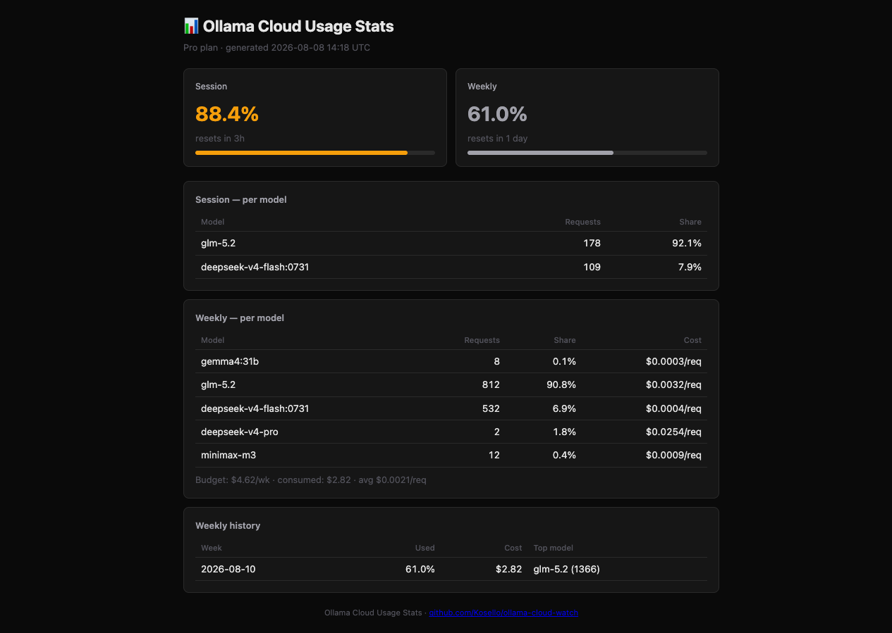

# Hermes Ollama Usage Monitor

Live Ollama Cloud usage in Hermes Agent — session & weekly quotas, per-model request counts, weekly history, average cost per request, and threshold alerts, right in the desktop app. Plus a **standalone CLI** that works without Hermes.




## Quick install

```bash
hermes plugins install Kosello/hermes-ollama-usage-monitor
```

Then add the desktop plugin (`desktop/plugin.js` → `~/.hermes/desktop-plugins/ollama-usage-monitor/`), set up the cookie (see [Install](#install)), restart the gateway, and reload desktop plugins (⌘K).

## What it shows

- **Statusbar chip** — always-visible `Pro S25% W35%` summary, color-coded (yellow ≥75%, red ≥90%)
- **Desktop pane** — full details:
  - Session & weekly usage % + reset times
  - **Per-model breakdown** — request counts and each model's share of the usage bar (session + weekly)
  - **Avg cost per request** — estimate in $ and % of weekly budget, per model
  - **Weekly history** — last 8 weeks of usage snapshots with trend arrow (↑/↓/→)
- **Threshold alerts** — macOS notification when weekly usage crosses 75% (warning) / 90% (critical), once per threshold per week
- **Daily usage line** — one short summary in chat every morning (`📊 Ollama Cloud: weekly 44.7% · session 81.6% · top: glm-5.2`)
- Auto-refreshes every 60s (manual refresh button + ⌘K palette command)

## Why

Ollama Cloud has **no usage API** — the only source is the web dashboard at [ollama.com/settings](https://ollama.com/settings). This plugin scrapes that page with your session cookie (same approach as the community [`/ollama` slash command](https://github.com/3L0935/hermes-plugins)) and adds a live desktop UI on top. Ollama's dashboard forgets everything when the week resets — this plugin keeps a **local history** that survives resets.

## Install

### 1. Backend (Python plugin)

```bash
mkdir -p ~/.hermes/plugins/ollama-usage-monitor
cp -r backend/* ~/.hermes/plugins/ollama-usage-monitor/
hermes plugins enable ollama-usage-monitor
```

### 2. Desktop plugin

```bash
mkdir -p ~/.hermes/desktop-plugins/ollama-usage-monitor
cp desktop/plugin.js ~/.hermes/desktop-plugins/ollama-usage-monitor/
```

Then in the app: **⌘K → Reload desktop plugins**

### 3. Cookie

The plugin reads your Ollama Cloud session cookie from **either**:

- **macOS Keychain** (recommended on macOS):
  ```bash
  security add-generic-password -s hermes-ollama-cookie -a ollama -w '<cookie>' -U
  ```
- **or a plain file** (works on any OS — Linux, Windows, etc.):
  ```bash
  echo '__Secure-session=<value>' > ~/.hermes/ollama_cookie.txt
  chmod 600 ~/.hermes/ollama_cookie.txt
  ```

**How to get the cookie value:**

1. Log in to [ollama.com](https://ollama.com) in your browser
2. Open DevTools:
   - **Chrome/Edge/Firefox:** `F12` or `⌘+Option+I` → **Application** tab → **Storage** → **Cookies** → `https://ollama.com`
   - **Safari:** `⌘+Option+I` → **Storage** tab → **Cookies** → `https://ollama.com`
3. Find the cookie named `__Secure-session`
4. Double-click the **Value** cell, select all (`⌘+A`), copy (`⌘+C`)
   - ✅ Make sure the **"Show URL-decoded"** checkbox is **checked** — the raw value is a base64 string starting with `YWdl…`
   - The cookie is **HttpOnly** (can't be read via JavaScript), so DevTools is the only way
5. Paste it into the file or Keychain command above (without the `__Secure-session=` prefix — the plugin adds that automatically)

**Note:** The cookie expires periodically. If the plugin shows "Unavailable", repeat steps 3–5 with the fresh value.

**Storage selection** via env var `OLLAMA_COOKIE_SOURCE`:
- `auto` (default) — Keychain if a cookie is stored there, otherwise the file
- `keychain` — Keychain only (errors if empty)
- `file` — file only (no Keychain dependency)

### 4. Restart

```bash
hermes gateway restart
```

### 5. Optional: alerts + daily line (cron)

```bash
# copy the helper scripts
cp scripts/ollama_usage_watch.py ~/.hermes/scripts/
cp scripts/ollama_usage_daily.py ~/.hermes/scripts/

# then in Hermes:
#   cronjob create:  ollama-usage-watchdog  → 30m → no_agent → ollama_usage_watch.py
#   cronjob create:  ollama-usage-daily     → 0 9 * * * → no_agent → ollama_usage_daily.py
```

The watchdog is **silent** until a threshold is crossed (no token cost, no spam). It also snapshots weekly usage into the history file, so history is recorded even when the desktop app is closed.

## Cost estimate methodology

Ollama Cloud bills by GPU-time utilization, not tokens. The per-request cost is a rough proxy:

```
weekly_budget   = plan_price / 4.33          # Pro $20/mo ≈ $4.62/wk
cost_consumed   = weekly_budget × weekly_used%
model_cost      = cost_consumed × model_share%
cost_per_req    = model_cost / requests
cost_per_req_%  = cost_per_req / weekly_budget × 100
```

The model share% comes straight from Ollama's own usage bar segments, which already reflect the GPU-time weighting — so heavier models (glm-5.2 = High) show higher per-request cost than lighter ones (deepseek-v4-flash = Medium).

## Caveats

- **Cookie scraping is brittle** — if Ollama changes their settings page markup or the cookie expires, the plugin shows "Unavailable". Re-extract the cookie and it's back.
- The cookie is a login token — keep it private (Keychain, or `chmod 600` on the file).
- Works only in the Hermes **desktop** app (the backend loads via the gateway; the chip/pane need the desktop UI). The `/ollama` slash command from the [community plugin](https://github.com/3L0935/hermes-plugins) covers CLI/TUI. For non-Hermes users, see the **Standalone CLI** below.

## Standalone CLI (no Hermes needed)

`standalone/ollama-cloud-watch.py` — a single Python file, zero dependencies (stdlib only). Works on macOS, Linux, Windows.

```bash
# Print current usage once
python standalone/ollama-cloud-watch.py

# Poll every 30 minutes, record history, fire threshold alerts
python standalone/ollama-cloud-watch.py --watch

# Record one snapshot (good for cron)
python standalone/ollama-cloud-watch.py --history

# Silent alert if threshold crossed (cron watchdog)
python standalone/ollama-cloud-watch.py --alert

# Generate full stats MD report
python standalone/ollama-cloud-watch.py --report --open
```

**Cookie setup** (same as the plugin):
```bash
# macOS Keychain:
security add-generic-password -s ollama-cloud-watch -a ollama -w '<cookie>' -U
# Or plain file:
echo '__Secure-session=<value>' > ~/.ollama-cloud-cookie.txt
```

**Cron examples (non-macOS or without Hermes):**
```bash
# Watchdog every 30 min
*/30 * * * * python /path/to/ollama-cloud-watch.py --alert --cookie ~/.ollama-cloud-cookie.txt
# Daily summary at 9am
0 9 * * * python /path/to/ollama-cloud-watch.py --history --cookie ~/.ollama-cloud-cookie.txt
```

History is written to `~/.ollama-cloud-history.jsonl` and sessions to `~/.ollama-cloud-sessions.jsonl` — independent from the Hermes plugin's files.

## Development

```bash
python tests/test_parser.py   # parser smoke test (no cookie needed — uses a saved HTML fixture)
```

CI (GitHub Actions) runs the smoke test + syntax checks on every push.

## Files

```
backend/
  plugin.yaml                 # Hermes plugin manifest
  dashboard/
    manifest.json             # backend API manifest
    plugin_api.py             # FastAPI router → scrapes ollama.com/settings
desktop/
  plugin.js                   # desktop plugin (statusbar chip + pane)
standalone/
  ollama-cloud-watch.py       # standalone CLI (no Hermes needed, stdlib only)
scripts/
  ollama_usage_watch.py       # threshold watchdog (Hermes cron, silent unless crossed)
  ollama_usage_daily.py       # daily one-line usage summary (Hermes cron)
tests/
  test_parser.py              # parser smoke test
  fixtures/settings_page.html # saved page snapshot for CI
```

## License

MIT
