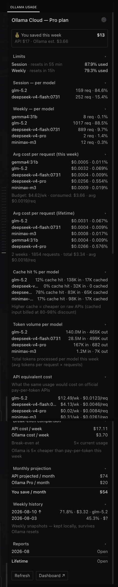

# Hermes Ollama Usage Monitor

> **⚠️ WORK IN PROGRESS — expect bugs.** This plugin is under active development.
> The core usage scraper and desktop chip/pane work, but you may hit rough edges
> (stale cache, parser breakage when Ollama changes their HTML, price-chain
> mismatches). If something breaks, [open an issue](https://github.com/Kosello/hermes-ollama-usage-monitor/issues).

Live Ollama Cloud usage in Hermes Agent — session & weekly quotas, per-model request counts, weekly history, honest subscription/API comparisons, and threshold alerts, right in the desktop app. Plus a **standalone CLI** that works without Hermes.




## Quick install

```bash
hermes plugins install Kosello/hermes-ollama-usage-monitor
```

Then add the desktop plugin (`desktop/plugin.js` → `~/.hermes/desktop-plugins/ollama-usage-monitor/`), set up the cookie (see [Install](#install)), restart the gateway, and reload desktop plugins (⌘K).

## What it shows

- **Statusbar chip** — always-visible `Pro S25% W35%` summary, color-coded (yellow ≥75%, red ≥90%)
- **Desktop pane** — full details:
  - Session & weekly usage % + reset times
  - **Per-model breakdown** — request counts and Ollama usage-bar share (session + weekly)
  - **API-equivalent cost** — estimated **$/request** and cache-aware effective **$/1M tokens**
  - **Plan vs API** — estimated Ollama $/1M versus real API $/1M for each model, plus Ollama/API percentage
  - **Weekly history** — last 8 weeks of usage snapshots with trend arrow (↑/↓/→)
- **Threshold alerts** — macOS notification when weekly usage crosses 75% (warning) / 90% (critical), once per threshold per week
- **Daily usage line** — one short summary in chat every morning (`📊 Ollama Cloud: weekly 44.7% · session 81.6% · top: glm-5.2`)
- Auto-refreshes every 60s (manual refresh button + ⌘K palette command)

## Why

The authenticated settings page is the primary source because its per-model bar widths expose each model's share of Ollama usage. `GET /api/usage` is the fallback: it provides aggregate quota percentages and request counts, but not per-model quota weights, exact resets, or plan tier. API-only mode therefore shows API prices but deliberately leaves per-model Ollama $/1M unavailable. Ollama's dashboard forgets everything when the week resets — this plugin keeps a **local history** that survives resets.

## Install

### 1. Backend (Python plugin)

```bash
mkdir -p ~/.hermes/plugins/ollama-usage-monitor
cp -r backend/* ~/.hermes/plugins/ollama-usage-monitor/
hermes plugins enable ollama-usage-monitor
```

### 2. Desktop plugin

```bash
mkdir -p ~/.hermes/desktop-plugins/ollama-usage-monitor
cp desktop/plugin.js ~/.hermes/desktop-plugins/ollama-usage-monitor/
```

Then in the app: **⌘K → Reload desktop plugins**

### 3. Cookie (primary source)

- **macOS Keychain** (recommended on macOS):
  ```bash
  security add-generic-password -s hermes-ollama-cookie -a ollama -w '<cookie>' -U
  ```
- **or a plain file** (works on any OS):
  ```bash
  echo '__Secure-session=<value>' > ~/.hermes/ollama_cookie.txt
  chmod 600 ~/.hermes/ollama_cookie.txt
  ```

Get `__Secure-session` from the browser's DevTools → Application/Storage → Cookies → `https://ollama.com`. It is an HttpOnly login token; keep it private. The plugin uses it to fetch the settings page because that page includes the per-model usage-bar shares required for Ollama $/1M estimates.

Storage selection via `OLLAMA_COOKIE_SOURCE`: `auto` (default), `keychain`, or `file`.

### 4. Plan tier (optional — defaults to Pro)

The API doesn't expose your plan tier (Pro/Free/Max), which affects budget calculations. Three ways to set it:

- **In the desktop pane** — click ⚙ → choose Free / Pro / Max. Persists to `~/.hermes/ollama-usage-plan.txt`.
- **Config file:**
  ```bash
  echo 'pro' > ~/.hermes/ollama-usage-plan.txt
  ```
- **Environment variable:** `export OLLAMA_PLAN=pro`

If none are set, the plugin tries to scrape the plan from the cookie. If that also fails, it defaults to Pro ($20/mo).

### 5. API key (fallback)

If the cookie is absent or expired, the plugin tries `GET https://ollama.com/api/usage` using `~/.hermes/ollama_api_key.txt` or `OLLAMA_API_KEY`:

```bash
echo 'YOUR_API_KEY' > ~/.hermes/ollama_api_key.txt
chmod 600 ~/.hermes/ollama_api_key.txt
```

The API fallback preserves aggregate usage percentages and request counts. It cannot reproduce per-model Ollama $/1M because it does not expose settings-page usage-bar shares, current-window tokens/cache, exact reset timestamps, or plan tier.

### 6. Restart

```bash
hermes gateway restart
```

Then in the desktop app: **⌘K → Reload desktop plugins**.

> **If the chip/pane don't appear after a gateway restart + reload**, fully
> **quit and relaunch the Hermes app** (⌘Q, not just close the window).
> Some plugin changes — especially to the desktop plugin JS or the backend
> router — only take effect after a complete app restart, because the
> gateway process and the desktop renderer cache module state separately
> and a hot reload doesn't always clear both.

### 7. Optional: alerts + daily line (cron)

```bash
# copy the helper scripts
cp scripts/ollama_usage_watch.py ~/.hermes/scripts/
cp scripts/ollama_usage_daily.py ~/.hermes/scripts/

# then in Hermes:
#   cronjob create:  ollama-usage-watchdog  → 30m → no_agent → ollama_usage_watch.py
#   cronjob create:  ollama-usage-daily     → 0 9 * * * → no_agent → ollama_usage_daily.py
```

The watchdog is **silent** until a threshold is crossed (no token cost, no spam). It also snapshots weekly usage into the history file, so history is recorded even when the desktop app is closed.

## Cost methodology

Ollama's authenticated settings page exposes aggregate quota utilization, per-model request counts, and each model's **share of the usage bar**. The public API exposes the first two, but not the bar shares. The plugin therefore uses the cookie-backed settings page first and the API only as a limited fallback.

### Estimated Ollama $/1M

```text
allocated plan value = 7-day plan equivalent × normalized model usage-bar share
Ollama $/1M          = allocated plan value / estimated model tokens × 1,000,000
```

This is an effective plan-price estimate—not an Ollama token tariff. The full fixed 7-day plan equivalent is allocated across models by Ollama's own usage-bar shares, normalized so rounded bars reconcile exactly to the plan fee; it is never scaled down by the percentage of quota used. Token volume comes from historical Hermes averages because Ollama does not expose current-window tokens or cache reads. A bar rounded to `0.0%` is reported as unavailable rather than guessed. API-only mode also reports per-model Ollama $/1M as unavailable because request share is not quota share.

### API-equivalent estimate

```text
$/req = uncached_input × input_rate
      + cached_input   × cache_rate
      + output         × output_rate

effective $/1M = $/req / ((uncached_input + cached_input + output) / 1,000,000)
```

The **Plan vs API** table compares each model's estimated Ollama effective $/1M with its real pay-per-token API effective $/1M. `Ollama/API` shows the Ollama estimate as a percentage of the API estimate; lower means better subscription value. API input/cache/output component rates are displayed separately.

Historical Hermes usage stores uncached input and cache-read input as separate canonical buckets. Request counts come from Ollama. Token mix comes from historical Hermes `session_model_usage` averages; an unknown model uses the request-weighted all-model average, then a 1000-input/500-output fallback when no local data exists. Prices use this per-model chain:

| Level | Prices (per 1M tokens) | Tokens per request |
|---|---|---|
| 1 | **Manual override** for that model in `~/.hermes/ollama-usage-prices.json` | **Manual override** for that model (`tokens_per_request`) |
| 2 | **Live OpenRouter fetch** (cached 24h) | **Hermes state.db** per-model average |
| 3 | Builtin defaults (bundled table) | Request-weighted all-model `state.db` average |
| 4 | — | 1000 in + 500 out assumption |

The pane shows which source was used: `Prices: OpenRouter (live) · Tokens: Hermes state.db`. To pin prices yourself, copy `ollama-usage-prices.example.json` → `~/.hermes/ollama-usage-prices.json` and edit; delete the file to revert to automatic.

Manual entries merge on top of automatic data; a partial override does not hide other models. Cache-hit input uses the published cache rate. If no cache rate is published, the normal input rate is used — missing pricing never means free cache.

## Caveats

- **Cookie scraping is brittle** — if Ollama changes its settings markup or the cookie expires, the tool falls back to `/api/usage`; per-model Ollama $/1M remains unavailable until the cookie is refreshed.
- The cookie is a login token — keep it private (Keychain, or `chmod 600` on the file).
- API-equivalent values are estimates based on historical token mix, not Ollama's current-window token telemetry. They explain pay-per-token economics; they do not explain Ollama's proprietary quota percentage exactly.
- Works only in the Hermes **desktop** app (the backend loads via the gateway; the chip/pane need the desktop UI). The `/ollama` slash command from the [community plugin](https://github.com/3L0935/hermes-plugins) covers CLI/TUI. For non-Hermes users, see the **Standalone CLI** below.

## Standalone CLI (no Hermes needed)

`standalone/ollama-cloud-watch.py` — a single Python file, zero dependencies (stdlib only). Works on macOS, Linux, Windows.

```bash
# Print current usage once
python standalone/ollama-cloud-watch.py

# Poll every 30 minutes, record history, fire threshold alerts
python standalone/ollama-cloud-watch.py --watch

# Record one snapshot (good for cron)
python standalone/ollama-cloud-watch.py --history

# Silent alert if threshold crossed (cron watchdog)
python standalone/ollama-cloud-watch.py --alert

# Generate full stats MD report
python standalone/ollama-cloud-watch.py --report --open

# Serve the self-contained dashboard
python standalone/ollama-cloud-watch.py --serve

# When Hermes API already uses IPv4 port 8642, keep it working and bind the
# dashboard to IPv6 loopback at the same localhost URL:
python standalone/ollama-cloud-watch.py --serve --host ::1 --port 8642
```

**Recommended API-key setup:**
```bash
install -m 600 /dev/null ~/.ollama-cloud-api-key.txt
# Paste the key into that file, or export OLLAMA_API_KEY.
```

The cookie/Keychain setup remains available as a fallback if the official API
cannot be used.

**Cron examples (non-macOS or without Hermes):**
```bash
# Watchdog every 30 min
*/30 * * * * python /path/to/ollama-cloud-watch.py --alert
# Daily summary at 9am
0 9 * * * python /path/to/ollama-cloud-watch.py --history
```

History is written to `~/.ollama-cloud-history.jsonl` and sessions to `~/.ollama-cloud-sessions.jsonl` — independent from the Hermes plugin's files.

## Development

```bash
python tests/test_parser.py   # parser smoke test (no cookie needed — uses a saved HTML fixture)
```

CI (GitHub Actions) runs the smoke test + syntax checks on every push.

## Files

```
backend/
  plugin.yaml                 # Hermes plugin manifest
  dashboard/
    manifest.json             # backend API manifest
    plugin_api.py             # FastAPI router → scrapes ollama.com/settings
desktop/
  plugin.js                   # desktop plugin (statusbar chip + pane)
standalone/
  ollama-cloud-watch.py       # standalone CLI (no Hermes needed, stdlib only)
scripts/
  ollama_usage_watch.py       # threshold watchdog (Hermes cron, silent unless crossed)
  ollama_usage_daily.py       # daily one-line usage summary (Hermes cron)
tests/
  test_parser.py              # parser smoke test
  fixtures/settings_page.html # saved page snapshot for CI
```

## License

MIT
